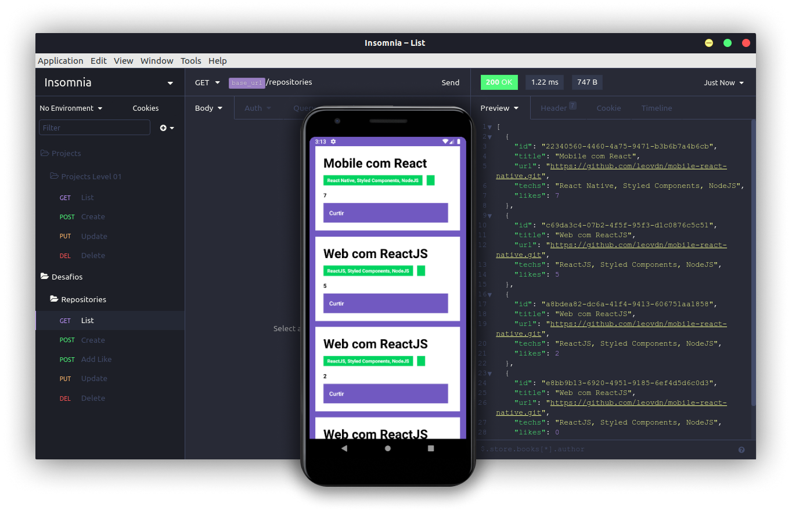

# Desafio React Js - GoStack
Projeto para a prática dos conceitos de React Native utilizando o Backend em NodeJs criado nos desafios anteriores.

Tem a função de realizar a chamada da API de repositórios criada no desafio de Node.Js, fazendo a listagem de repositórios com suas respectivas informações além de exercer a função de **Curtir** determinado repositório.

 

## Requisitos de aprovação :

- [x] Listar os repositórios da sua API: Deve ser capaz de criar uma lista de todos os repositórios que estão cadastrados na sua API com os campos title, techs e número de curtidas seguindo o padrão ${repository.likes} curtidas, apenas alterando o número para ser dinâmico.

- [x] Curtir um repositório listado da API: Deve ser capaz de curtir um item na sua API através de um botão com o texto Curtir e deve atualizar o número de likes na listagem no mobile.

### BackEnd da Aplicação 
- [Repositório - Desafio NodeJs]([https://link](https://github.com/leovdn/gostack-desafio-nodejs))

